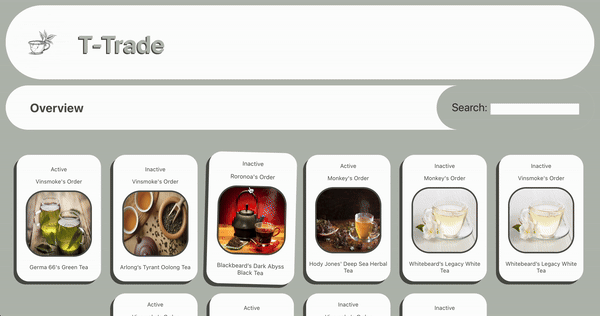

<a id="readme-top"></a>
<h1 align='center'> T-Trade </h1>
<section align='center'>
  
</section>
<details>
  <summary>Table of Contents</summary>
  <ol>
    <li>
      <a href="#about-this-project">About The Project</a>
      <ul>
        <li><a href="#built-with">Built With</a></li>
      </ul>
    </li>
    <li>
      <a href="#getting-started">Getting Started</a>
      <ul>
        <li><a href="#installation">Installation</a></li>
      </ul>
    </li>
    <li><a href="#accessibility">Accessibility</a></li>
    <li><a href="#contributors">Contributors</a></li>
  </ol>
</details>

## About this project
* T-Trade is an E-commerce website designed for vendors to view, search and edit their subscribers' subscriptions to tea deliveries. The site renders all subscriptions with their corresponding tea brand, and customer. There is a search bar that allows a vendor to search for specific clients by name, or specific teas by title. Clicking on a subscription instance will give a more detailed overview of both the tea, and the customer information. If a vendor would like to active or deactivate a subscription they have the option to do so on the subscription's page. This update will persist to the overview page as well.
* This application is design to be run locally in conjunction with the corresponding backend repo [Link to Back end repo](https://github.com/kylomite/tea-sub-api).


### Built With:
 ![React][React.js]<br/>
 ![React_router][React_router]


## Getting Started
### Installation

1. Clone this repo
  ```
  git clone git@github.com:kylomite/tea-sub-front-end.git
  ```
2.  Install necessary dependencies and run
  ```
  npm install
  ```
3. Change git remote url to avoid accidental pushes to base project
  ```
  git remote set-url origin github_username/repo_name
  git remote -v # confirm the changes
  ```
4. Run on localhost:3001
 - *NOTE*: The back-end should be runnning on `localhost:3000`, and the CORS config explicitly whitelists `localhost:3001`, If ran elsewhere the CORS policy will block the data from populating 
 ```
 npm start
 ```
 - Terminal should declare the default port `localhost:3000` is in use, and ask if user would like to use another
 ```
 Y
 ```
 - The front end should now be live


## Accessibility

* This application utilizes accessible design with semantic HTML tags. This features allows for tabbable, screen-reader friendly content.
* The application uses high contrast visuals along with animations to increase pointer focus for visually impaired users.
* The application uses the Chrome Dev Tools Lighthouse feature to test accessibility achieving a 100% score

## Contributors
<section style="display: flex; gap: 10px;">
  <div style="text-align: center;">
    <h4>Kyle Delaney</h4>
    
    <br/>
    <a href="https://www.linkedin.com/in/kylehamptondelaney/" target="_blank">LinkedIn<a> 
    <br/> 
    <a href="https://github.com/kylomite" target="_blank">Github</a>
  </div>


<!-- https://www.markdownguide.org/basic-syntax/#reference-style-links -->

[React.js]: https://img.shields.io/badge/React-20232A?style=for-the-badge&logo=react&logoColor=61DAFB
[React_Router]: https://img.shields.io/badge/React_Router-20232A?style=for-the-badge&logo=react-router&logoColor=#ffffff